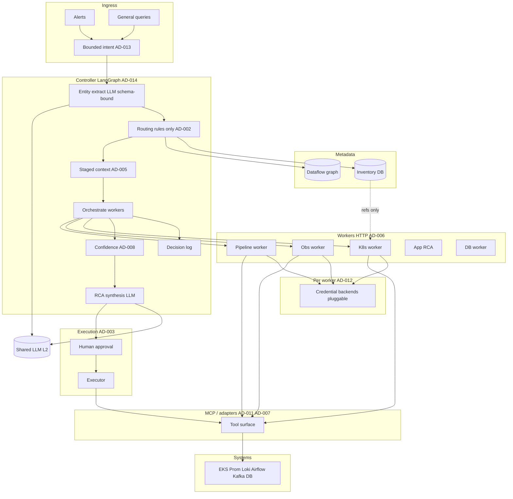

# Decisions Log — Infinity-Sentinel

> A living record of every meaningful decision made during design and implementation.
> **Why this file exists:** so that future sessions — AI or human — don't re-debate
> settled questions, and so the reasoning behind every choice is preserved, not just
> the choice itself.

**Document scope:** these decisions are **product / programme requirements** — they travel with **whatever git repo or branch** you use to implement Infinity-Sentinel / FixOps. Copy this file (with `GOAL.md`, north-star `.mdc`, diagrams) into a **new** repository as the source of truth; it is **not** owned by or limited to any one legacy codebase.

---

## How to use this file

When you make a decision during implementation, add an entry here:

```
### ID-XXX · Short title
**Decision**: what was decided (one sentence)
**Why**: the reasoning that made this the right call
**Rejected alternatives**: what was considered and why it lost
**Status**: LOCKED | REVISIT IF <condition> | SUPERSEDED BY ID-XXX
**Date**: YYYY-MM-DD
```

LOCKED = do not re-open without a very good reason.
REVISIT IF = conditions under which this should be reconsidered.
SUPERSEDED = this decision was replaced; see the new entry.

---

## Architecture Decisions (pre-implementation, all LOCKED)

### AD-001 · One controller, many domain workers

**Decision**: A single controller orchestrates all workers. Workers do not call each other.
**Why**: Predictable, auditable, easy to debug. Peer-to-peer worker mesh creates invisible reasoning paths.
**Rejected alternatives**: Peer-to-peer worker mesh; fully autonomous worker swarm without approval gate.
**Status**: LOCKED
**Date**: 2026-04

---

### AD-002 · Routing is rules-first, LLM is only for entity extraction

**Decision**: LLM extracts the entity (name, type, alert class) from the raw alert.
Deterministic rules then decide which worker runs. The LLM does not choose the next
investigation step.
**Why**: LLM routing is non-deterministic and hard to test; rules can be unit-tested and audited.
**Rejected alternatives**: Full LLM routing; regex-only entity extraction only.
**Status**: LOCKED
**Date**: 2026-04

---

### AD-003 · Execution is always human-gated

**Decision**: No remediation executes without explicit human approval in production.
Flow: suggest → human approves → execute → verify. Auto-remediation is a configurable opt-in for lower environments only.
**Why**: Trust is built incrementally; one bad autonomous action destroys credibility.
**Rejected alternatives**: Auto-execute with notification; auto-execute for “safe” actions only in prod.
**Status**: LOCKED for prod. Configurable for dev/staging.
**Date**: 2026-04

---

### AD-004 · Two metadata layers: Inventory and Dataflow Graph

**Decision**: **Inventory** — routing and access (cluster, creds ref, owner, observability bindings).
**Dataflow graph** — ownership and dependency (who produces/consumes).
**Why**: Mixing them produces an unmaintainable monolith at scale.
**Rejected alternatives**: One flat config; LLM-guessed dependencies from logs.
**Status**: LOCKED
**Date**: 2026-04

---

### AD-005 · Staged context loading (3 stages, hard token limits)

**Decision**: Stage 1 = cheap (alert + inventory + graph). Stage 2 = if inconclusive (logs, metrics, DAG status). Stage 3 = if still unclear (code, configs, runbooks, traces). Hard token and tool-call limits per stage.
**Why**: Most incidents resolve at Stage 1–2; Stage 3 is expensive.
**Rejected alternatives**: Load everything upfront; no staged limits.
**Status**: LOCKED
**Date**: 2026-04

---

### AD-006 · Worker output is structured JSON (fixed contract)

**Decision**: Every worker returns exactly:

```json
{
  "checked": ["what was inspected"],
  "findings": ["what was found"],
  "evidence_refs": ["log line IDs, metric timestamps, config keys"],
  "ruled_out": ["what was eliminated and why"],
  "confidence": 0.0,
  "next_suggested_check": "optional hint to controller"
}
```

**Why**: Structured output is testable and parseable; freeform text between workers is brittle.
**Rejected alternatives**: Freeform summaries; raw log dumps between agents.
**Status**: LOCKED
**Date**: 2026-04

---

### AD-007 · Everything goes through tool adapters

**Decision**: Workers never call infrastructure as unstructured spaghetti. All access goes through **adapter interfaces** (MCP servers and/or typed in-process adapters) that can be mocked, swapped, rate-limited, and audited.
**Why**: Testability and portability.
**Rejected alternatives**: Direct SDK soup inside workers with no boundaries.
**Status**: LOCKED
**Date**: 2026-04

---

### AD-008 · Confidence scoring gates escalation and conclusion

**Decision**: Each worker produces confidence 0.0–1.0. Example policy: ≥0.85 conclude; 0.50–0.84 escalate; <0.50 flag low confidence. Thresholds tunable.
**Why**: Auditable stopping without LLM-only “we’re done.”
**Rejected alternatives**: LLM decides when to stop; always run all workers.
**Status**: LOCKED (thresholds tunable)
**Date**: 2026-04

---

### AD-009 · RAG layer for institutional knowledge

**Decision**: Semantic (or hybrid / vector-less) retrieval over Confluence runbooks, past RCA
reports, service READMEs, DAG docs, and monitoring runbooks. **Bounded** injection (e.g. top-3 chunks, ~300 tokens total) per investigation — not full runbooks in prompt.
**Update paths**: Confluence webhook; GitHub post-merge for READMEs; index on RCA completion; periodic re-index.
**Why**: Generic LLM knowledge misses team-specific fixes (“reduce BATCH_SIZE…”).
**Rejected alternatives**: Full runbook load every time; no institutional retrieval at all.
**Status**: LOCKED (design). Retrieval backend (pgvector, OpenSearch BM25-only, hybrid) is an **implementation** choice.
**Phasing on a legacy incremental codebase:** may land after core alert path. **Greenfield / full rebuild:** RAG (or vector-less equivalent) may ship in **v1 from the start** if desired — AD-009 defines *what* is retrieved and *how* it is bounded, not a mandatory calendar deferral for greenfield.

**Date**: 2026-04

---

### AD-010 · Inventory is YAML in Git, loaded into a queryable DB

**Decision**: Inventory source of truth is YAML in Git, validated, loaded into Postgres (or Mongo). Keep it **thin** — stable routing metadata, not every DAG field.
**Why**: Reviewable, auditable, rollback-friendly; stale inventory is visible in Git history.
**Status**: LOCKED
**Date**: 2026-04

---

### AD-011 · MCP for tools: reuse community MCP; custom MCP for Airflow and similar

**Decision**: **Prefer MCP** tool servers where they help (standard protocol, reuse, isolation). Use maintained MCP where it fits. For Airflow, Kafka-style APIs, etc., **custom MCP** wrapping REST/SDK is **expected**.

**Typed in-process adapters** remain **allowed per integration** when MCP adds no clear win yet — same **AD-007** boundaries (interfaces, mocks, rate limits).

**Reuse:** Port well-tested tool code from reference projects (e.g. HolmesGPT toolsets, IncidentFox skills) behind MCP or adapters — **harvest tooling**, not their routing/orchestration model.

**Why**: Uniform tool surface where used; AD-007 governs all paths to prod data.

**Rejected alternatives**: Only domains with public MCP; unstructured SDK calls everywhere.
**Status**: LOCKED
**Date**: 2026-04-23

---

### AD-012 · Worker-owned credentials; controller passes references only (pluggable backends)

**Decision (architecture):** Controller passes **references only** (`credentials_ref`, `cluster_id`, entity keys). Workers resolve secrets **inside their trust boundary**. LLM prompts never contain raw credentials or kubeconfig bodies.

**Decision (implementation):** Pluggable credential backends — config/env/file for MVP; K8s Secrets, AWS SM, Azure Key Vault, Vault, etc., without changing LangGraph or HTTP contracts.

**Why**: Least blast radius; refs in routing metadata only.

**Rejected alternatives**: Controller forwards secret values; prod secrets baked into images.
**Status**: LOCKED
**Date**: 2026-04-23

---

### AD-013 · Unified architecture for alerts and general (ad-hoc) queries

**Decision**: **One** LangGraph pipeline: same rules-first routing after bounded intent, same inventory/graph, same **AD-006** contract, same decision log. General queries normalize to structured intent (synthetic alert + session).

**Why**: Avoid a second “chat architecture” later.

**Rejected alternatives**: Forked alert-only vs chat-only graphs.
**Status**: LOCKED (architecture). Feature delivery may still phase UX.
**Date**: 2026-04-23

---

### AD-014 · Controller stack: LangGraph

**Decision**: Controller investigation loop uses **LangGraph** (checkpointing, conditional edges, human-in-the-loop for approval).
**Why**: Fits multi-worker orchestration and auditable state.
**Status**: LOCKED
**Date**: 2026-04-23

---

### AD-015 · Dual HTTP ingress: strict vs planner-backed

**Decision**: Keep **`POST /v1/investigations/run`** for **already-normalized** payloads (no ingress LLM). Add **`POST /v1/investigations/run-planned`** for **natural language** and/or **messy partial JSON**: a **planner** (mock in CI, shared LLM when configured) emits the same `normalized` object, then the **identical LangGraph** runs. Responses include **`planning.normalized`** and **`planning.planner_mode`** for audit.

**Why**: Integrations that speak the contract avoid planner cost and non-determinism; humans and legacy systems get one front door without forking the pipeline.

**Rejected alternatives**: Single endpoint with optional planner flag (harder to reason about auth and SLOs); separate microservice for planning only (extra hop for v1).

**Status**: LOCKED (pattern). Planner heuristics and prompts may evolve.

**Date**: 2026-04-25

---

## Open Questions

| # | Question | Resolve before |
|---|---|---|
| OQ-01 | ~~LangGraph vs custom?~~ | **SUPERSEDED** — **AD-014** |
| OQ-02 | ~~Workers vs MCP?~~ | **SUPERSEDED** — HTTP workers + **MCP and/or adapters** — **AD-011** / **AD-007** |
| OQ-03 | Approval UX: Slack, web, ticket? | Phase 5 |
| OQ-04 | Auto-remediation aggressiveness in dev/staging? | Phase 5 |
| OQ-05 | Incident history storage for RAG pipeline? | RAG phase |
| OQ-06 | Single Executor vs per-domain? | Phase 5 |
| OQ-07 | Multi-owner Kafka topics? | Phase 4 |

---

## Mode B — Interactive / conversational entry

**Status:** Architecture **locked with Mode A** (**AD-013**). Delivery of rich chat may follow alerts.

**What it is:** Natural-language follow-ups → **bounded structured intent** → same pipeline as alerts. Not LLM-freeform tool selection.

| Area | Responsibility |
|------|----------------|
| **Entry** | HTTP, CLI, Slack, web — all call controller |
| **Intent** | LLM only with strict JSON schema + validation + allowlists |
| **Controller** | Synthetic alert + session; same routing, workers, confidence, decision log |
| **State** | Thread id, prior steps, token budget — controller / graph, not peer workers |

---

## Master architecture diagram (reference)

**Portable artifact:** `context/comparison/fixops-architecture-master.html` — SVG layers + Mermaid + optional download button.

**Mermaid** (same as in `fixops-agentic-northstar.mdc` and inside the HTML file):



---

## Superseded Decisions

*None beyond OQ-01 / OQ-02 rows in the Open Questions table.*

---

*Infinity-Sentinel / FixOps · Last updated: 2026-04-25*
